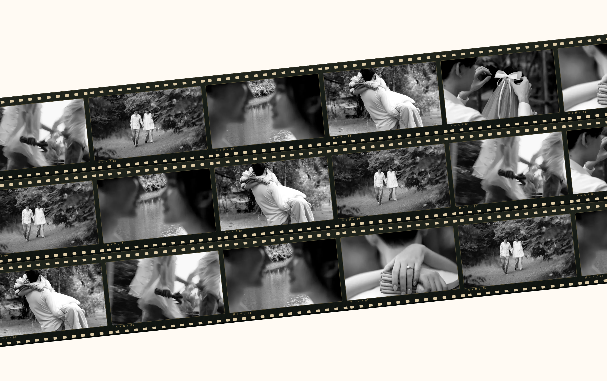
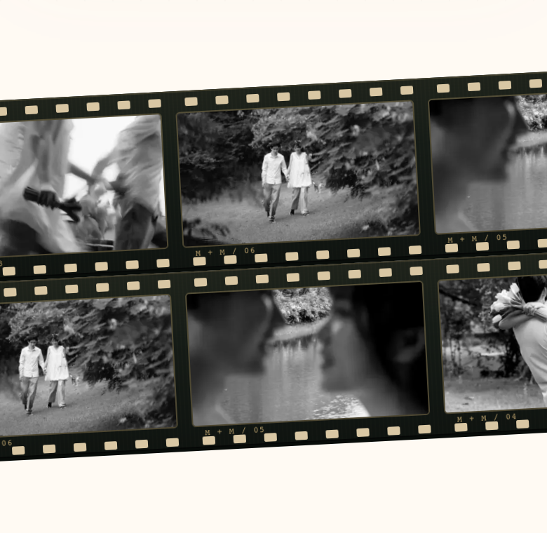
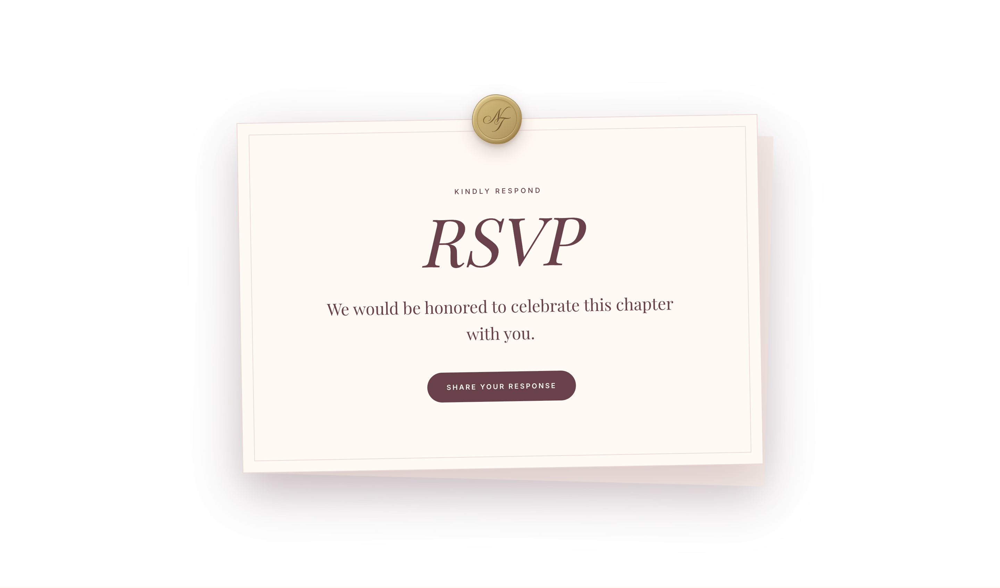

# Standalone film-strip relocation — 2026-10-03

> **Current visible-strip and split-background revision:** Section height now fits the complete rotated strip plus at least 8px vertical clearance per side: 428px at viewport 390, 770px at 1440, 887px at 2560. Strip size and tilt remain unchanged. The background is exactly 50% dress-code pink (#eed4d8) and 50% timetable burgundy (#68414b). Browser checks confirm matching neighboring colors, full vertical clearance, one row, correct order, no overflow/page errors, and white RSVP. All 122 tests, production build, targeted ESLint and diff checks passed. Latest evidence: `assets/2026-10-03-film-split-*`.

> **Current single-strip revision:** One diagonal strip (-6° desktop, -3° mobile) now occupies the section, with both row and section heights equal to three original strips: 591px at desktop 1440/2560 and 386px at mobile 390. The six grayscale display files are 1280×720, totaling 223,960 bytes, with every file below 80 KB. The section remains between dress code and schedule. All 122 tests, production build, targeted ESLint, and diff checks passed. Chrome verified exactly one row, matching section height, no overflow or page errors, and white RSVP at 390/1440/2560. Loop-boundary screenshots were pixel-identical. Current screenshots and reports: `assets/2026-10-03-film-single-*`. Earlier multi-strip details below are historical.

> **Latest correction:** The section now sits between dress code and timetable. Outer vertical padding is removed. Desktop height is exactly three row heights (rounded up; 591px at 1440px), mobile is two row heights (257px). Partial additional strips fill tilted edges so no empty cream wedges remain. All 122 tests and production build passed; targeted ESLint and diff checks passed. Chrome at 390/768/1440/2560 verified compact height, full corner coverage, correct neighboring sections, no overflow or page errors, and white RSVP. Updated screenshots and evidence: `assets/2026-10-03-film-compact-*`. Earlier roomy-stage dimensions below describe the superseded revision.

The user moved the film treatment from RSVP into the former video/framed-photo space between family and dress-code chapters. FilmStripChapter now renders WeddingFilmStrips there, preserving the existing `framed-photo` anchor and updating its section announcement. The former portrait/video is no longer mounted in that space. RSVP has a plain white background behind its existing cream invitation and unchanged working form.

The standalone film layout has exactly two rows below 768px and three rows at larger widths. Its stage fits the rotated row stack with extra vertical clearance rather than adding rows to cover background corners. Dark film stock, brass perforations, shuffled grayscale photos, seamless paired groups, lazy four-source batches, offscreen/hidden-page pausing, reduced motion, and Save-Data behavior are preserved. Six existing optimized WebP files are reused; no additional image downloads or dependencies are introduced. Frame counts fall to 32 mobile and 48 desktop at common widths.

## Verification

- Tests for relocation, plain-white RSVP, and standalone layout failed before implementation and passed afterward.
- `npm test`: 122 passed, zero failures.
- `npm run build`: successful production build and TypeScript check.
- `npm run lint`: zero errors, one existing React Hook Form warning in RSVPForm.tsx.
- Chrome checks at widths 320, 390, 768, 1440, and 2560: correct section order, exactly two/three rows, all six sources mixed in each group, no adjacent duplicates, no horizontal overflow, and no page errors.
- Rotated strips fit fully within their stage: ≥16px vertical clearance mobile and ≥32px desktop. Desktop-to-mobile resizing changes three rows to two and restores three on return.
- Deterministic animation loop boundary: zero differing pixel channels.
- Browser confirms RGB(255,255,255) RSVP background, no film nodes in RSVP, and successful form opening/closing at all five widths without submitting records.
- Reduced-motion browser context confirms static strips. Physical Safari/iOS and extended steady-state traces were not rerun for this relocation.
- Reviewed desktop/mobile strips and white RSVP screenshots. Production preview restarted on port 3100. Changes remain uncommitted; unrelated DressCodeChapter changes were preserved.

Browser evidence: `assets/2026-10-03-film-relocated-browser.json`.
