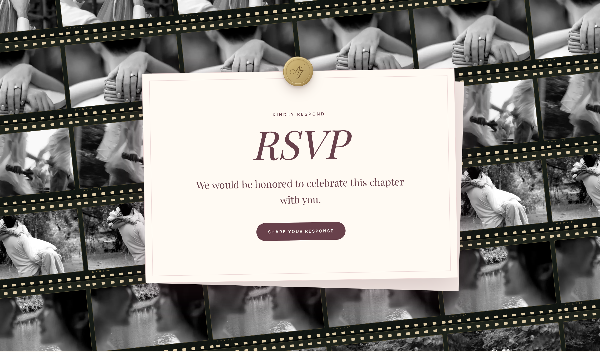
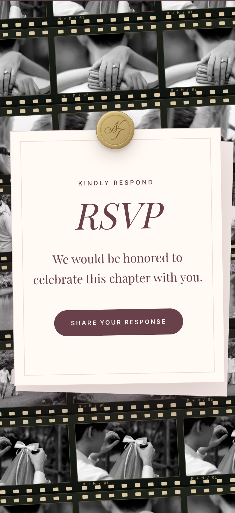
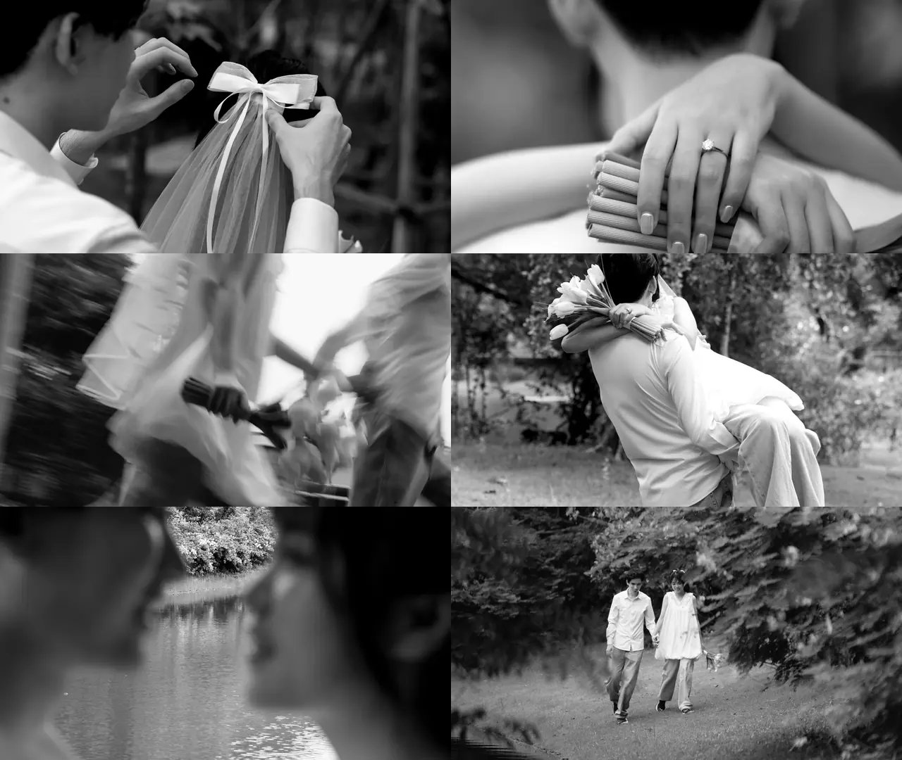

# RSVP six-photo strip revision — 2026-10-03

> **Superseded assignment:** The user subsequently requested these six grayscale images mixed across every strip. The current implementation uses a deterministic shuffle per row, includes all six images in every group, avoids adjacent identical images including the group seam, and repeats identical groups for the loop. Orders remain stable during rerenders. No image assets, grayscale processing, loading batches, frame geometry, or animation speed changed. Verification: 120 tests passed; production build succeeded; lint has zero errors and the existing RSVPForm warning. Chrome checks passed at all five previous viewport widths, with six unique sources and no page errors. Loop-boundary screenshots remain pixel-identical. New evidence is saved as `assets/2026-10-03-rsvp-six-mixed-*`.

The user replaced the mixed 51-photo sequence with six attached photographs. Every frame in a strip now repeats that strip’s assigned image. The sequence follows attachment order: 81, 82, 114, 194, 254, 33. Randomized starting positions are removed. Additional rows required to cover responsive corners repeat the same six-photo sequence.

All six display assets and inline placeholders are prepared in grayscale. Original JPEGs stay untouched outside public. Subject-aware crops retain the veil bow, ring, embrace, lake portraits, and walking couple. Photo 114 retains its intentional source motion blur. Each derivative is 640×360 WebP; total source-display bytes are 86,292 (largest 24,828), well below the existing image budgets. The runtime downloads only the six sources, using the existing four-source loading batches and shared URLs for repetitions. No CSS grayscale filter or new animation work is added.

The dark film stock, brass perforations and frame labels, 100% film opacity, zero-opacity pink wash, invitation card, and automatic pause conditions are preserved.

## Verification

- New strip-assignment and grayscale-preparation tests failed before implementation and passed afterward.
- `npm test`: 119 tests passed, zero failures.
- `npm run lint`: zero errors; one existing React Hook Form warning in RSVPForm.tsx.
- `npm run build`: successful production build and TypeScript check.
- Local production Chrome at widths 320, 390, 768, 1440, and 2560: one source per strip, all six selected sources present, correct cycling for additional rows, fully loaded frames, corner clearance ≥48px, no horizontal overflow or page errors. Six rows at 1440px; seven or eight at other tested widths to preserve coverage.
- Deterministic loop-boundary screenshots: identical, zero differing pixel channels. Physical Safari/iOS and long natural-cycle traces were not rerun for this content-assignment revision.
- Reviewed desktop/mobile screenshots and all six crops. Preview server restarted on port 3100 with the production build.

Browser and loop evidence are saved beside these images as `2026-10-03-rsvp-six-browser.json` and `2026-10-03-rsvp-six-wrap.json`. Changes remain uncommitted; unrelated DressCodeChapter changes were preserved.
