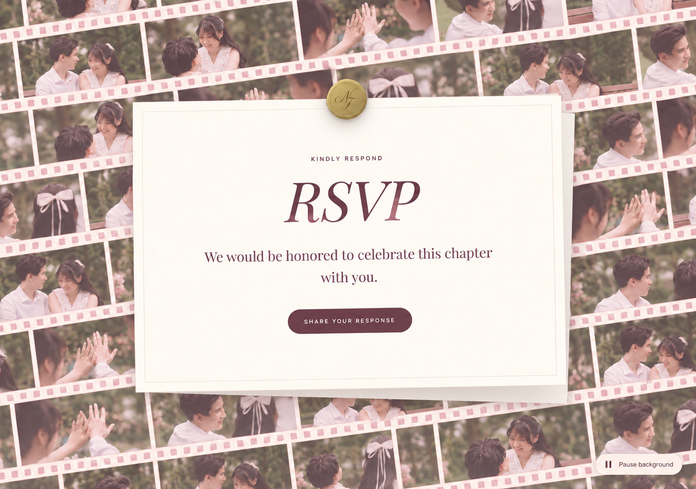

# RSVP Film Background Implementation Plan

> **Visible tilted strip and connecting background:** Keep the single strip itself three original row heights tall, but expand its section to contain the entire rotated strip plus 8px clearance on each side vertically. Split the section background exactly at 50%: `--color-petal` (#eed4d8) above, matching dress code, and `--color-wine` (#68414b) below, matching the timetable. Preserve the -6° desktop / -3° mobile angle, current section order, and white RSVP background.

> **Single large strip, 2026-10-03:** The user requested one film strip with the height of three original strips. Render exactly one diagonal row (-6° desktop, -3° mobile), with its height and the section height both equal to three original row heights (591px at 1440px viewport; 386px on mobile). Scale photo apertures proportionally at 16:9, keep the section between dress code and timetable, and retain the mixed six-photo loop. Export these six photos at 1280×720 for the larger display; combined derivatives are 223,960 bytes and each remains below the 80 KB limit. This supersedes multiple rows and tilted corner fillers.

> **Compact placement correction, 2026-10-03:** The user requested a section height equal to three main desktop strips (two on mobile), with partial extra strips filling the angled edge spaces. Remove outer vertical padding and size the stage directly from the row height; use additional rows only for full corner coverage. Move this section between dress code and the timetable, including section-order metadata. This supersedes the roomy standalone stage and earlier placement below family.

> **Current placement, 2026-10-03:** The user moved the film treatment out of RSVP into the former video/framed-photo space, between family and dress-code sections. `FilmStripChapter` mounts the reusable `WeddingFilmStrips` component at the retained `framed-photo` anchor. Show exactly two mobile strips and three desktop strips; size the cream stage around their rotated bounds instead of adding coverage rows. Preserve the mixed six-photo grayscale library, paired seamless groups, lazy batched loading, offscreen/hidden-page pauses, and reduced-motion/Save-Data handling. RSVP now uses plain white behind its existing invitation card and working form. This placement and fixed row count supersede all earlier RSVP-background coverage requirements. No video or framed portrait is mounted in that space.

> **Latest assignment revision, 2026-10-03:** The user found one repeated image per strip unnatural and requested the same six grayscale photos scrambled across all strips. Each row now uses an independent deterministic shuffle, includes all six photos, and avoids consecutive duplicates including its loop seam. Both loop groups retain identical sequences. Ordering stays stable during rerenders, with no additional image sources or runtime dependencies. This supersedes the per-strip assignment described below.

> **Current photo assignment, 2026-10-03:** The user replaced the shuffled 51-photo background with six supplied photos (81, 82, 114, 194, 254, 33), in attachment order. Each strip repeats its own single photo across both identical loop groups. Any additional rows needed for responsive corner coverage cycle the six-photo sequence. Prepare all six as grayscale 640×360 WebP files, including inline grayscale placeholders, without modifying the original JPEGs. This supersedes scene scrambling and randomized starting positions. Preserve the current dramatic dark film stock, brass perforations, 100% film opacity, 0% pink overlay, and automatic motion pauses. See `docs/reviews/2026-10-03-rsvp-six-photo-strips.md` for validation.

> **Photo-library update, 2026-10-02:** The user selected 50 new photos plus the existing one. The implemented library now contains 51 unique prepared entries, with individually reviewed crops and a deterministic scene-aware scramble. This supersedes the temporary 60-slot placeholder mapping. See `docs/reviews/2026-10-02-rsvp-film-51-photos.md` for the real-photo checks.

> **For agentic workers:** REQUIRED SUB-SKILL: Use superpowers:executing-plans for sequential implementation, or superpowers:subagent-driven-development if the user chooses delegation. Steps use checkbox (`- [ ]`) syntax for tracking.

**Goal:** Replace the RSVP section's single faint background photograph with endless, gently moving wedding-photo film strips densely covering the entire background, matching the user-approved mockup and existing romantic stationery theme.

**Architecture:** A dedicated client component fills an oversized, rotated background plane with closely stacked decorative film rows behind the existing invitation card. Row count and loop length adapt to the measured section dimensions; CSS handles continuous translation while React handles resize, loading, visibility, manual pause, and the RSVP modal pause condition. Two identical, explicitly sized groups per row provide the seamless loop without a per-frame JavaScript animation loop.

**Performance priority:** Site loading speed, RSVP responsiveness, and smooth mobile scrolling take precedence over maximizing photo uniqueness. A library of 48–60 photos is optional content capacity, not a requirement to download or render 48–60 unique photos at once. The earlier chat recommendation of 48 photos was a visual-variety estimate, not a tested performance recommendation.

**Tech Stack:** Existing Next.js 16.2.7, React 19.2.4, Tailwind CSS 4, CSS keyframes, Next Image, existing reduced-motion hook, and Node's test runner/component harness. No new runtime or testing dependencies.

**Spec:** The embedded Design Specification below is the design basis for this plan. Read it together with the tasks. Implementation was authorized by the user after approving the mockup and performance priorities. See the validation report for executed checks and remaining device coverage.

**Approved visual reference:** On October 1, 2026, the user approved the revised mockup with film strips filling the whole background. This supersedes the earlier three-row concept. The reference is saved with the plan so implementation does not depend on a temporary attachment or generated-image directory.

## Global Constraints

- Implementation is authorized. The approved mockup is a documentation asset only; use real supplied photographs as the background assets.
- Film strips must cover the entire section background, including all corners and margins around the card. Use only narrow seams between rows; no broad empty pink bands and no fixed three-row limit.
- Performance is a release requirement. Start with the supplied placeholder photograph shared across 60 editable records; expand only within the active-set and byte budgets below. Prefer some repeated photographs over slower loading or janky interaction.
- Use the attachment for film-strip arrangement and motion inspiration only; preserve the site's cream, blush, dusty-rose, wine, and muted-gold theme.
- Preserve the existing RSVP copy, cream invitation card, wax seal, button, entrance animation, section anchor, and submission behavior.
- Use existing wedding photographs and optimized assets; do not add the reference image to the site or generate substitute wedding photographs.
- Keep animation decorative, keyboard controls operable, and reduced-motion users on a static composition.
- Add no dependencies. Do not alter the existing video player's `.film-frame` or `.film-frame-viewport` styles.
- Read the installed Next.js image and client-component guides before implementation; use the local 16.2.7 APIs.
- Browser verification must use mocked submission responses; do not create real RSVP or blessing records.

## Codebase Findings and Baseline

- `src/components/v4/RSVPChapter.tsx` currently renders `PHOTOS[6]` with `fill`, `sizes="100vw"`, eager/low-priority loading, opacity 0.14, and saturation 0.7 over a pink gradient. The invitation uses a 53rem minimum-height wrapper and a 46.875rem maximum-width card.
- `src/content/wedding.ts` already exports optimized gallery, opening, framed, and final photographs with blur placeholders and crop positions. The implementation uses the user-supplied photograph until distinct photos are selected. Prepare small, cropped RSVP derivatives during implementation rather than sending the large portrait sources into every wide background aperture.
- `src/app/globals.css` supplies the theme tokens and the separate video-frame styles. New selectors must use an `rsvp-film-` prefix.
- `src/hooks/useHydrationSafeReducedMotion.ts` deliberately reports false during the server render and first hydration render. A CSS reduced-motion media query is also necessary to prevent a pre-hydration animation flash.
- `RSVPChapter` already owns `isRSVPOpen`; pass that state into the background. `RSVPForm` uses a fixed `z-50` overlay as a sibling of the current visual wrapper. Do not transform, filter, or contain the entire section, which could change the modal's positioning or stacking.
- `tests/helpers/componentHarness.mjs` executes real component handlers with hook doubles. `tests/video-playback.test.mjs` demonstrates observer/visibility-event testing and cleanup. Reuse these patterns instead of adding a browser-test framework.
- Baseline on October 1, 2026: `npm test` passed **101/101**, with zero failures. Node emits an existing module-type warning. Build, lint, and browser checks were not run for this documentation-only task.
- Inspected installed guides: `node_modules/next/dist/docs/01-app/01-getting-started/12-images.md`, `01-app/03-api-reference/02-components/image.md`, and `01-app/03-api-reference/01-directives/use-client.md`. Next Image needs accurate `sizes`; `priority` is deprecated; the current default quality is 75.

## Design Specification

### Visual direction and alternatives

Use a dense, edge-to-edge field of parallel, slightly diagonal strips that drift behind the stationery card. Match the approved mockup's approximately six visible rows plus partial edge rows at its desktop proportions; this is a density reference, not a hardcoded row count. Add enough rows to fill the actual section at every screen size. Cream film rails, blush-colored sprocket openings, a fine wine border, and restrained shadows connect them to the invitation and existing video frame. Retain natural photo color with a light blush overlay; avoid the original inspiration image's dark film stock, sepia grading, distressed edges, labels, and grain.

A rendered video would make photo replacement and responsive cropping harder. Repeated CSS-driven rows keep content editable and reuse the same small set of image URLs. The approved change is full photographic coverage: film continues behind the card and beyond every viewport edge, with only narrow seams between the ivory rails. Do not shrink or reposition the card to expose extra photography.

The card remains opaque cream. The moving photographs should be recognizable around it, rather than being reduced to the current 14% opacity. Final browser tuning uses film opacity 0.78, saturation 0.85, and a petal overlay at 0.18 opacity. These are visual tuning values; inspect them in the browser and record any changes in the validation report. Do not animate filters or shadows.

### Photos and crops

The user's implementation instruction supersedes the earlier eight-photo selection: use `/Users/tanakan.pramot/Documents/I found you - Mimi/I found you -167.jpg` throughout the background for now. Preserve a local preparation source at `assets/rsvp-film/placeholder-source.jpg`, outside `public`. Prepare one 640×360 WebP at `/photos/display/rsvp-film/placeholder.webp` and create 60 records with unique slot IDs sharing that same source and blur placeholder. Do not create 60 identical files or use cache-busting URLs to simulate unique photographs.

`src/content/rsvpFilmPhotos.json` stores prepared records. `RSVP_FILM_PHOTOS` maps the 60 editable slots over all prepared records in order; when additional unique photographs are supplied, add them to the preparation manifest and regenerate. The library limits and source deduplication apply whether the records share one URL or reference different photographs.

Retain the existing source records unchanged; define crop positions specifically for the RSVP derivatives. The bench portrait was visually inspected during planning: the couple occupies the lower half, so a wide film aperture needs a crop review. Inspect each prepared photograph at the actual aperture size before accepting its crop. The background images render with empty alt text inside an `aria-hidden` layer, even though their reusable content records retain descriptions. Use the real source photographs in implementation; the generated mockup is a composition guide, not a source of cropped replacement photos.

The starting library has 60 editable records but only one distinct source, as explicitly requested. Support additional user-supplied photographs up to a 60-photo library without requiring more rows, longer DOM tracks, or downloading the full library. Do not make additional photo delivery a prerequisite for the initial implementation.

For each page visit, select a bounded active set: at most 16 unique sources below 768px, at most 32 at larger widths, and never more than the library contains. Use a per-mount starting index generated only after hydration and assign `active[j] = library[(start + j) % library.length]`; keep this selection stable while the section is visible. On viewport changes, retain overlapping selections rather than reshuffling everything. Photo choice can differ on a later page visit; do not continually download new batches merely to eliminate repetition during one visit.

For row `i` and frame slot `j`, use `active[(i * 11 + j) % active.length]`. Adjacent rows therefore receive different sequences when enough photos exist. The second loop group must copy the first group exactly. Small libraries necessarily repeat: do not claim zero simultaneous duplicates. Photo uniqueness is best-effort within the performance budgets.

### Performance requirements and budgets

These are project acceptance targets to validate, not claims of measured performance. The initial implementation may use fewer than the active-set limits if needed to pass them.

| Concern | Required implementation / acceptance target |
| --- | --- |
| Initial page load | Zero additional RSVP photo requests before the section reaches the 600px loading margin. Existing hero/gallery requests are separate baseline traffic. No RSVP photo preload/high-priority request. |
| Source library vs active set | Library may contain 48–60 records; active set is capped at 16 mobile / 32 desktop. The library length must not multiply DOM frame count. No automatic full-library prefetch. |
| Image preparation | Prepare 16:9 WebP derivatives with a maximum size of 640×360, using the existing Sharp tooling. Target 20–50 KB per image; hard ceiling 80 KB per prepared derivative. Start quality at 75, reduce only after visual inspection, and preserve source photos. No original JPEG/PNG or full-height portrait downloads for this background. |
| Incremental transfer | Cold-cache RSVP image-body transfer for one active set: at most 800 KB mobile / 1.6 MB desktop. Count actual delivered responses, not only source files. Inspect DPR 1, 2, and 3; do not assume `sizes` alone caps network/decode cost. |
| Loading burst | Mount at most four new unique sources in a loading batch. Advance only after all representatives in the current batch load/decode or error. Repeated instances use the same source and size; they do not consume additional distinct-source slots. Stop admitting further batches outside the 600px loading margin, when the document is hidden, or while the form is open. Resume without restarting completed requests. |
| Memory | At 640×360, a typical four-byte decoded bitmap is about 0.88 MiB; 16 unique images represent about 14 MiB and 32 about 28 MiB before browser/compositor overhead. These are estimates, not a total-memory guarantee. Profile decoded images/layers and require no continuing memory growth after the initial active set is loaded during a 3-minute steady loop. |
| Animation | Animate row transforms only. No animation-frame React updates, animated filters, animated box shadows, large backdrop blur, or `will-change` on every photo. Limit composited animation surfaces to the row tracks and inspect layer size. |
| Priority and fallback | RSVP interaction stays usable during image loading. Failed/slow images retain fixed placeholders. Reduced motion remains static; offscreen states pause motion; leaving the loading margin, hidden-tab, and open-form states stop new loading batches. |

Keep the rendered frames bounded by layout coverage, not by the number of available photos: two groups per row, the existing coverage-derived row count, and only the necessary sequence repetitions. Reusing a URL can avoid repeated transfer, but does not make additional DOM nodes, painting, decoded bitmaps, or GPU layers free.

Use `scripts/prepare-rsvp-film-photos.mjs` with the existing Sharp dependency to write derivatives under `public/photos/display/rsvp-film/`. Keep its explicit source/crop manifest in that script and preserve full-resolution originals. After applying the intended 16:9 crop, the content record uses `objectPosition: "50% 50%"`; generate a matching tiny blur placeholder. The script must report output dimensions/bytes and fail the 80 KB ceiling rather than silently accepting oversized assets. Check aggregate active-set budgets separately.

Implement loading batches with one representative frame per new source; hold other occurrences at their placeholders until the representative is ready. If a batch remains unsettled for 15 seconds, keep placeholders and stop further admission for that visibility session rather than starting an unbounded queue; retry outstanding work on the next section entry. Ignore late callbacks after unmount and clean up timers. Do not fetch blobs or keep a second application-owned full-image cache. The browser controls its cache and decoded-image lifetime, so do not promise immediate memory release.

For supported `navigator.connection.saveData === true`, select at most eight sources and keep the full-coverage composition static; load that bounded set through the same four-source batches and keep it static, without loading further library photos. Do not rely on this optional API being present. A normal mobile device still gets the approved animation if the performance checks pass.

Guidance checked for this revision: [web.dev image performance](https://web.dev/learn/performance/image-performance) covers correctly sized images, responsive selection, and compression; [web.dev animation performance](https://web.dev/articles/animations-guide) explains transform-based animation and avoiding layout/paint-heavy effects. Also follow the installed Next Image guide for `sizes`, loading, and quality configuration.

### Geometry and seamless motion

- Measure the visual wrapper with ResizeObserver, including height changes caused by wrapping text and zoom. Let its untransformed dimensions be `W` and `H`. Use angle −6° at widths of at least 768px and −3° below 768px.
- Center and rotate one bounded background plane, leaving the card/control outside that plane. For angle magnitude `a` in radians, use `planeWidth = ceil(W*cos(a) + H*sin(a)) + 96` and `requiredHeight = ceil(H*cos(a) + W*sin(a)) + 96`. This inverse-rotation coverage calculation adds a 48px safety margin on each side and prevents exposed corners on wide or tall sections. Clip only at the section and row windows.
- Set desktop frame pitch to `min(280, max(220, W*0.20))` pixels; mobile pitch is 180px. A pitch includes a 12px trailing separator. Use a 16:9 aperture with `object-fit: cover`, reflecting the wider frames and denser rows in the approved mockup. Each top/bottom rail is 16px high on desktop and 12px on mobile. Perforations repeat within the rails without a DOM element per hole.
- With `apertureWidth = framePitch - 12`, define `rowHeight = apertureWidth*9/16 + 2*railHeight`. Stack rows with a 2px seam, so `rowPitch = rowHeight + 2`. Use `rowCount = ceil(requiredHeight / rowPitch)`, and plane height `rowCount * rowPitch`. Every row spans the plane width; do not position individual rows at section percentages. Full coverage takes precedence over any exact number of visible rows.
- Each group allocates a minimum of eight frame slots. Use `sequenceRepeats = max(1, ceil(planeWidth / (8*framePitch)))`; group width is `sequenceRepeats * 8 * framePitch`. Assign photos across all slots using the active-set rule above; the eight-slot allocation unit does not require repeating the same eight images. Extra slots on ultrawide screens preserve frame size and density instead of stretching photographs. Render exactly two identical groups per track, each that width; include trailing separators inside each group and use border-box sizing. No extra gap or padding sits between groups.
- Translate from zero to negative one group width. Even-indexed rows move left; odd-indexed rows use reverse direction. Use linear, infinite keyframes. Cycle row speeds through 14, 16, and 15 pixels/second on desktop and 10, 12, and 11 pixels/second on mobile; duration is group width divided by the selected speed. Use deterministic starting offsets of `-(i % 8) * duration / 8` seconds and photo offsets defined above.
- Server and first-client markup must match. Initially render 12 static placeholder rows distributed evenly across a centered plane with `inset: -50%`; use flexible row heights for this initial state. After the first measurement, apply the calculated geometry and row count and allow animation when the other pause conditions permit. ResizeObserver updates only layout changes, never animation frames; use stable row keys. If ResizeObserver is unavailable, measure on mount/window resize and retain the full-cover static placeholder until dimensions are available. Clean up either subscription.
- The reset must reproduce the same image, separator, and perforation positions. Pause/resume changes `animation-play-state` without remounting rows or restarting keyframes. Resizing may reflow the composition but must not reveal gaps or cause horizontal page overflow. Apply the same coverage geometry when reduced motion is enabled.

Expose the pure sizing function as `getRSVPFilmLayout(width: number, height: number): RSVPFilmLayout | null` in `src/lib/rsvpFilmLayout.ts`. Return null for non-finite or non-positive dimensions. `RSVPFilmLayout` contains `angleDeg`, `planeWidth`, `planeHeight`, `framePitch`, `railHeight`, `rowPitch`, `rowCount`, `sequenceRepeats`, and `groupWidth`, all numbers. The component uses this single result for widths, row generation, image sizes, and duration so JS/CSS cannot independently disagree about coverage.

### Loading, controls, and lifecycle

`RSVPFilmBackground({ modalOpen }: { modalOpen: boolean })` owns its state and the pause control. Its root fills the visual wrapper and ignores pointer events; an inner decorative layer is `aria-hidden`. The control restores pointer events, is outside that hidden layer, and is positioned in the lower-right section margin above the background, with a minimum 44px touch target, solid cream surface, wine text, and visible focus indication.

Use the visible labels **Pause background** and **Resume background**. The label reflects manual pause state, which persists for the component's mounted lifetime. Do not automatically clear manual pause when closing the form or returning to the section. Under reduced motion or reduced-data mode, show the static rows and omit the unnecessary motion control.

Start with inline blur placeholders for the frames, using the starting library for deterministic initial markup. A near-section IntersectionObserver with `rootMargin: "600px 0px"` enables the bounded loading queue, using eager loading at low fetch priority only for admitted sources; do not mount the full library at once. Use a separate visibility observer with zero margin to pause motion while the actual section is offscreen. New loading batches are permitted within the near-section margin while the document is visible and the form is closed. If IntersectionObserver is unavailable, check the section bounding rectangle on mount and passive scroll/resize events, scheduling at most one visibility calculation per animation frame; retain the same queue limits and remove listeners on cleanup.

Use `fill` and `sizes` matching the measured aperture width (`framePitch - 12` pixels), rather than a fraction of the whole repeated track, with the small prepared derivatives as sources. Use the default Next Image quality. Do not preload these background photos or introduce a higher quality outside the configured allowlist. Reuse the same URLs and sizes across duplicate frames and verify actual network reuse. Keep a permanent inline-blur fallback beneath each image; on image failure hide the failed image while preserving its fixed frame. Do not wait for every photograph to load before showing the section or starting movement.

The effective pause condition is manual pause OR modal open OR reduced motion OR reduced-data mode OR section not visible OR document hidden OR geometry not ready. Listen to `visibilitychange` and clean up observers/listeners on unmount. Define the reduced-motion CSS override independently of JavaScript and keep server/first-client markup deterministic. No React state updates occur on animation frames.

### Layering and scope

Within the existing relative visual wrapper: blush base → full-cover decorative film → light blush wash → existing invitation card at z-10 → margin pause control at z-20. Any edge fade must be narrow and translucent, leaving film visible at the boundaries; do not fade large areas to empty pink. Restrict transforms and any new stacking isolation to the visual wrapper/background, keeping `RSVPForm` outside it. Avoid a large backdrop-blur layer over animated photographs.

No changes to navigation, other chapters, form fields, backend, card downloads, submission APIs, or wedding-video assets are part of this plan.

## Review Focus

1. Narrow, tall, zoomed, or ultrawide sections must stay covered at every corner and between every row; geometry tests belong to Task 2, resize lifecycle tests to Task 3, and browser checks to Task 4.
2. Large libraries, slow requests, and image failures must respect active-set/byte limits, preserve frames, and allow responsive RSVP use; handler tests belong to Task 2 and network checks to Task 4.
3. Reduced motion before hydration and after preference changes must never leave continuous motion active; lifecycle tests belong to Task 3 and browser checks to Task 4.
4. Manual pause must survive modal, viewport, and hidden-tab transitions; event-sequence tests belong to Task 3.
5. The decorative layer must not intercept the RSVP button or alter fixed modal/focus behavior; integration tests belong to Task 3 and browser checks to Task 4.

## File Map

| File | Responsibility |
| --- | --- |
| `src/content/wedding.ts` | Extensible photo library, 60 editable slots sharing one prepared source initially |
| `scripts/prepare-rsvp-film-photos.mjs` (new) | Prepare cropped small WebP derivatives and report/check output sizes |
| `public/photos/display/rsvp-film/` (new during implementation) | Background-sized photo derivatives; preserve existing media |
| `src/components/v4/RSVPFilmBackground.tsx` (new) | Decorative rows, image fallback, loading/visibility state, and accessible pause control |
| `src/lib/rsvpFilmLayout.ts` (new) | Pure coverage, adaptive row count, and repeated-group sizing |
| `src/components/v4/RSVPChapter.tsx` | Replace the old background and pass existing modal state |
| `src/app/globals.css` | Scoped film geometry, perforations, keyframes, responsive layout, reduced-motion override |
| `tests/wedding-content.test.mjs` | Verify configured film media exists and is reusable |
| `tests/rsvp-film-background.test.mjs` (new) | Real handler/lifecycle tests with the existing component harness |
| `tests/rsvp-film-layout.test.mjs` (new) | Corner coverage, responsive density, and horizontal loop coverage |
| `docs/superpowers/plans/assets/2026-10-01-rsvp-film-background-approved.png` | Approved visual reference; never used as a website background asset |
| `tests/v4-ending.test.mjs` | Retain current RSVP contract and add modal/background integration coverage |
| `docs/reviews/2026-10-01-rsvp-film-background-validation.md` (new during implementation) | Check results, screenshots, crop choices, and any unverified coverage |

> **User revision, 2026-10-01:** Remove the visible pause/resume button and its manual-pause state. Retain automatic modal, viewport, visibility, reduced-motion and Save-Data pauses. This overrides manual-control requirements below. Swap the first two `GALLERY_PHOTOS` records with their descriptions and blur metadata intact.

## Task 1: Define and Validate the Photo Sequence

**Files:** Modify `src/content/wedding.ts` and `tests/wedding-content.test.mjs`; create `scripts/prepare-rsvp-film-photos.mjs` and derived images under `public/photos/display/rsvp-film/` during implementation.

**Interfaces:** Produce `RSVP_FILM_PHOTOS`, the readonly library described in the specification, initially 60 records sharing the supplied photograph. Consume the existing source photographs and prepare dedicated small derivatives. Run preparation with `node scripts/prepare-rsvp-film-photos.mjs`; do not regenerate unrelated page media.

- [ ] Capture the before-change performance baseline specified in Task 4 before editing application files; save the measurements in the validation report.
- [x] Test 60 unique slot IDs sharing one source, prepared file dimensions/bytes, blur placeholders, and future multiple-prepared-photo mapping. Use synthetic unique sources for library-cap tests; real multi-photo transfer/memory testing awaits selected photos.
- [x] Run `node --test tests/rsvp-film-content.test.mjs`; observed the missing library assertion fail before implementation, then pass.
- [x] Implement the preparation script using the existing Sharp tooling, run it, inspect the supplied crop and compression, and add `RSVP_FILM_PHOTOS` referencing the shared derivative. Preserve all current photo assignments elsewhere. Record source/output bytes and image quality in the implementation validation report.
- [x] Run the focused content/preparation tests; inspect the actual shared crop and finalize it against the integrated desktop/mobile component in Task 4.

## Task 2: Build the Continuous Film Presentation

**Files:** Create `src/components/v4/RSVPFilmBackground.tsx`, `src/lib/rsvpFilmLayout.ts`, `tests/rsvp-film-layout.test.mjs`, and `tests/rsvp-film-background.test.mjs`; modify `src/app/globals.css` and RSVP-specific crops in `src/content/wedding.ts` if needed.

**Interfaces:** Export default `RSVPFilmBackground({ modalOpen }: { modalOpen: boolean })`. Consume `RSVP_FILM_PHOTOS` and `getRSVPFilmLayout(width, height)` with the result type defined above. Keep row/image subcomponents private to the component file. Task 3 adds the lifecycle and integrates this interface without changing it.

- [x] Add meaningful component tests using `componentHarness`: the decorative subtree has no focusable content; image error handlers leave a visible placeholder in a fixed frame; a repeated group's source sequence matches its first group. Test runtime output/handlers rather than source text or snapshots of CSS declarations.
- [x] Test photo assignment with synthetic 8-, 48-, and 60-record libraries: no out-of-range access, at most 16 active mobile or 32 active desktop sources, stable assignment during an uninterrupted visit, and identical frame-node counts for the same viewport regardless of library length. After assigning all slots, the duplicate group must exactly match its first group.
- [x] Add pure geometry tests for 320×1000, 390×1200, 768×1024, 1440×848, and 2560×1440 sections. Inverse-rotate all four section corners and assert each is inside the calculated plane with at least 47px safety clearance. Assert stacked rows cover the plane, the seam is 2px, group width covers plane width, and groups contain whole eight-slot allocation units. Assert a taller section adds rows, desktop pitch stays within 220–280px, mobile pitch stays at 180px, and zero/NaN/infinite dimensions return null. Test geometric invariants instead of copying the sizing formulas as the expected result.
- [x] Run `node --test tests/rsvp-film-layout.test.mjs tests/rsvp-film-background.test.mjs`; expect failure before the new modules exist.
- [x] Implement the pure layout function, adaptive tightly stacked rows, paired groups, decorative image semantics, inline placeholders, failure handling, and the specified sizing/translation contract. At this isolated stage render full images directly so failure handlers can be exercised; Task 3 adds the near-section loading gate before mounting the component on the page.
- [x] Add the prefixed CSS rules, shared rotated plane, perforations, 2px row seams, responsive frame sizes/speeds, light blush wash, and reduced-motion override. Preserve the existing video-frame rules byte-for-byte. Do not shrink the foreground card or retain the previous percentage-based row positioning.
- [x] Run the focused tests; expect them to pass. Review the width accounting: whole eight-slot allocation units per group, exactly two groups, and no external gap. Compare the intended composition with the approved mockup. Browser geometry and crop acceptance follow integration in Task 4; handler tests alone do not establish that the visual loop is seamless.

## Task 3: Integrate RSVP and Motion Controls

**Files:** Modify `src/components/v4/RSVPFilmBackground.tsx`, `src/components/v4/RSVPChapter.tsx`, `tests/rsvp-film-background.test.mjs`, and `tests/v4-ending.test.mjs`.

**Interfaces:** Consume `modalOpen` from `isRSVPOpen`, the existing `useHydrationSafeReducedMotion()` hook, ResizeObserver, IntersectionObserver, and document visibility. Keep the component mounted through pause transitions; export no new global motion state.

- [x] Add harness tests with observer/document doubles before implementing lifecycle behavior. Cover: initial placeholders before near-section entry; one-time image mounting after near entry; no unloading on exit; pause offscreen; pause when the document is hidden; observer fallback; and cleanup after unmount. Restore all replaced globals after each test.
- [x] Add loading-queue tests with a 60-photo fixture: no full-image requests before the loading margin; at most four newly admitted unique sources per batch; duplicate occurrences wait for their representative; load/error settles one representative and a subsequent batch waits for all current representatives; a stalled batch stops admission after 15 seconds; and later re-entry retries without accumulating duplicate work. Assert that no sources beyond the active-set cap are ever admitted and that hidden-page/open-form/away-from-section states block new batches. Test cleanup and late callbacks.
- [ ] Test reduced-data mode with the optional connection API present and absent. Assert at most eight sources and no animation when Save-Data is enabled; otherwise preserve the normal limits. Do not add device fingerprinting or user-agent-based behavior.
- [x] Add resize-sequence tests: initial unmeasured static markup → measured desktop section → same width with greater height → mobile width → zero-sized measurement → restored dimensions. Assert that valid dimensions recalculate enough rows, invalid measurements retain the last valid geometry (or initial static fallback), no width/height update clears manual pause, and resize subscriptions are cleaned up. Exercise the window-resize fallback when ResizeObserver is absent.
- [x] Add pause-sequence tests: enter view → manually pause → open form → close form → leave/re-enter view → hide/show document. Assert playback remains paused until explicit resume. With manual pause false, opening pauses and closing resumes only when visible and motion is allowed. Toggling the reduced-motion hook result must enforce static presentation regardless of manual state.
- [x] Add a parent integration test that invokes the real RSVP opener and close callback. Assert the form's `isOpen` and background's `modalOpen` change together; retain existing contrast/copy/section-anchor assertions. Stub the form to avoid network submissions.
- [x] Run `node --test tests/rsvp-film-background.test.mjs tests/v4-ending.test.mjs tests/reduced-motion.test.mjs`; expect new lifecycle/integration assertions to fail against the presentation-only component.
- [x] Implement measured coverage, bounded active-set selection, the four-source loading queue, viewport/document visibility, reduced-data behavior, manual pause, and cleanup using the specification's conditions. Use the layout helper for every valid resize; retain prior valid geometry on a zero/invalid measurement. Add the accessible control outside the decorative hidden subtree. Use CSS as the initial reduced-motion safeguard.
- [x] Replace only the old photo/overlay block in `RSVPChapter` with the film component and pass `modalOpen={isRSVPOpen}`. Remove imports made unused by that replacement. Retain the card, form, and their relationship to the visual wrapper.
- [ ] Run the focused tests again; expect all to pass. Check the control using keyboard activation and verify it never appears inside the `aria-hidden` subtree.

## Task 4: Verify the Result and Record Evidence

**Files:** Create `docs/reviews/2026-10-01-rsvp-film-background-validation.md`; tune only the files already listed if verification reveals a defect.

**Interfaces:** Validate the finished page, not only isolated components. Preserve all existing RSVP behavior and the site's photo-loading priorities.

- [ ] Before application edits begin, capture a production-mode baseline of five cold-cache loads using the same browser/version, viewport, and machine, with 4× CPU slowdown and a fixed 1.6 Mbps down / 750 Kbps up / 150ms latency network profile. Include both ordinary page entry and direct navigation to RSVP. Record median/range for LCP, CLS, transferred bytes, and scripted RSVP button-to-next-paint latency. Repeat after implementation with identical settings; do not compare a development build with a production build. Field INP is not established by this lab test.

- [x] Run `npm test`, `npm run lint`, `npx tsc --noEmit --incremental false`, `npm run build`, and `git diff --check`. Require no new failures; record inherited warnings or environment-related build blockers separately. Do not claim a blocked build passed.
- [ ] Inspect 320×568, 390×844, 768×1024, 1440×900, and 2560×1440 layouts, plus phone orientation changes and 200% zoom. Compare desktop composition directly with the approved mockup: densely stacked strips across every exposed background area, approximately six rows plus partial rows at similar proportions, narrow seams, soft blush finish, and unchanged card prominence. Inspect all four corners, side margins, and top/bottom edges while resizing and when text makes the section taller. Require no broad pink bands, exposed base-color wedges, body overflow, or clipped controls. Include Chromium and Safari/iOS where available; label untested environments.
- [ ] Observe two full natural-speed loops for each row on desktop and mobile. Also inspect paused frames just before and after the wrap using browser animation controls. Acceptance: no blank trailing edge, jump in subject position at the wrap, detached perforations, or repeated card motion. Pausing/resuming must retain the animation position.
- [ ] With a cold cache and throttled network, jump directly to RSVP and scroll normally to it. Verify placeholders occupy every frame until images arrive. Block one photo URL and confirm the frame/fallback remains, neighboring photos continue, and RSVP stays usable. Inspect actual requested image sizes and confirm no film-photo preload or high-priority requests were added.
- [ ] Verify the performance gates: median initial-page LCP regression no greater than the larger of 200ms or 10% of baseline; no more than 0.01 additional CLS and no frame-area shift from photo arrival; scripted RSVP button-to-next-paint at most 200ms under the same lab profile; and incremental RSVP image transfer within 800 KB mobile / 1.6 MB desktop. Record actual totals and whether each gate passed. These are project budgets, not promised Core Web Vitals scores.
- [ ] Inspect a browser performance recording with the dense background moving, including a representative physical mobile device when available. On a 60Hz test device, target fewer than 5% dropped frames during a 30-second steady-state trace and no background-attributable main-thread task longer than 50ms after image loading settles. Record a 3-minute loop to check for continuing image/node/layer or memory growth; JavaScript heap alone does not establish image/GPU memory usage. Confirm no per-frame React work, no resize feedback loop, and shared image requests across duplicates.
- [ ] Test 48- and 60-photo fixture libraries without requiring additional real wedding photos: verify active-set/request caps and unchanged DOM frame counts, then test real-asset byte/decoding performance with the available images. Do not claim a hypothetical future 60-photo library has passed real-photo performance testing. If a budget fails, reduce active unique photos first, then derivative bytes/resolution and expensive effects while preserving full coverage and the approved frame scale. Do not silently raise budgets or revert to three spaced strips; document any remaining blocker before shipping.
- [ ] Test reduced motion enabled before navigation, then toggle it while viewing RSVP. Confirm CSS prevents initial movement, the static composition stays visible, and the pause control is omitted while reduced motion is active. Check for hydration warnings.
- [ ] Exercise manual pause, modal open/close, scrolling away/back, and tab hide/show in combination. Confirm manual intent is retained and no background movement occurs behind the open form.
- [ ] Verify the RSVP button, modal focus containment, Escape/close behavior, focus return, and mocked acceptance/decline flows. Confirm the existing video frame and nearby chapters retain their appearance.
- [ ] Capture desktop/mobile screenshots and a short motion recording, and record commands/results, crop changes, actual browser coverage, and unresolved limitations in the validation report. Review the final diff for unrelated changes.

## Execution Handoff

Recommended approach: sequential implementation in this chat using `superpowers:executing-plans`; the four tasks share photo preparation, one background component, and coordinated visual/performance checks. Delegation remains an option if requested. Commit boundaries, if commits are requested during implementation, are the photo sequence, integrated film background, and final verification fixes; no commit or deployment is part of this planning turn.

The user approved the dense, full-background mockup, emphasized performance, and then requested implementation using one supplied photo for all slots until unique photos are selected. Preserve the approved coverage, density, palette, foreground card, and performance priority. See `docs/reviews/2026-10-01-rsvp-film-background-validation.md` for delivered behavior and verification limits.

## Planning Self-Review

- Scope and reference interpretation are explicit; the original planning phase made no application changes; implementation now follows the later explicit authorization.
- Every visual, motion, loading, accessibility, and modal requirement maps to a task and verification step.
- Photo exports, component props, file names, and test interfaces are consistent across tasks.
- The approved mockup is saved beside the plan. The earlier three-row limit and percentage-based row positions are superseded throughout.
- Loop sizing includes trailing separators, identical paired groups, adaptive row count, and rotated corner coverage; pause state avoids remounts.
- Manual pause, reduced motion before hydration, image failure, modal stacking, and observer cleanup have explicit checks.
- The optional 48–60-photo library is separate from active sources and DOM size. Image preparation, bounded loading, reduced-data behavior, byte budgets, and measured performance gates map to Tasks 1–4. Performance measurements are recorded in the implementation validation report; future genuinely distinct-photo measurements remain pending.
- The original baseline was 101 tests. Implementation adds behavior tests and production/browser evidence in the validation report.

### Implementation verification ruling

Tasks 1–3 are implemented. Task 4 production, responsive, keyboard, wrap-boundary, shared-image transfer and three-minute steady-state checks are recorded in the validation report. Some checkboxes retain their original broader acceptance wording: physical Safari/iOS/mobile traces, native zoom/orientation changes, two natural cycles of every row and real distinct-photo testing remain unverified. Deterministic wrap screenshots passed instead of waiting through two natural periods for every row. Future photo selection must trigger another performance pass. No commit, push or deployment was performed.
